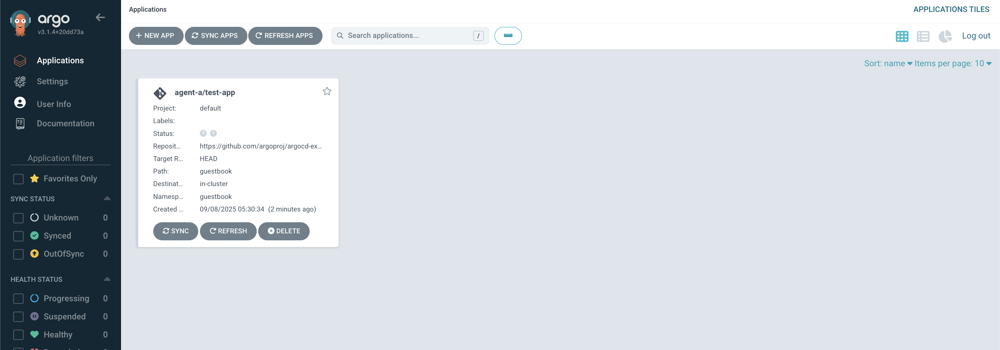
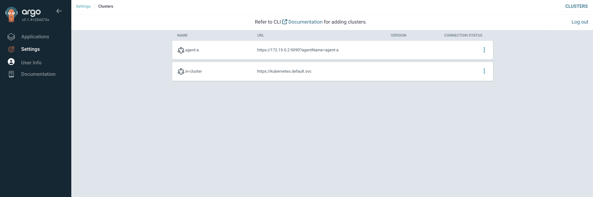

# Getting Start

## 목차
- [Getting Start](#getting-start)
  - [목차](#목차)
  - [로컬 환경 구성도](#로컬-환경-구성도)
  - [아키텍처 개요](#아키텍처-개요)
  - [사전 준비사항](#사전-준비사항)
  - [Control Plane 설정](#control-plane-설정)
  - [PKI 설정](#pki-설정)
  - [Principal 설치](#principal-설치)
  - [Workload Cluster 설정](#workload-cluster-설정)
  - [Agent 생성 및 연결](#agent-생성-및-연결)
  - [검증](#검증)
  - [cluster 재시작 명령어](#cluster-재시작-명령어)

## 로컬 환경 구성도
[ArgoCD-Agent 공식 가이드](https://argocd-agent.readthedocs.io/latest/getting-started/kubernetes/)를 따라 kind를 이용해서 로컬 환경을 구성합니다.

kind를 사용해서 로컬 Kubernetes 클러스터에 argocd-agent를 설치합니다.

Control Plane과 Workload Cluster를 각각 별도의 kind 클러스터로 구성하여
실제 운영 환경과 유사한 멀티 클러스터 환경을 로컬에서 테스트할 수 있습니다.

```
[로컬 머신]
 |
 |-- [Kind Cluster: argocd-hub]
 |     |-- [Argo CD Server, Principal]
 |
 |-- [Kind Cluster: argocd-agent1]
       |-- [Argo CD App Controller, Agent]

[개발자의 코드 에디터/IDE]
  |
  |-- [Argo CD 소스 코드]
```

## 아키텍처 개요
```
Control Plane Cluster           Workload Cluster(s)
┌─────────────────────┐        ┌─────────────────────┐
│ ┌─────────────────┐ │        │ ┌─────────────────┐ │
│ │   Argo CD       │ │        │ │   Argo CD       │ │
│ │ ┌─────────────┐ │ │        │ │ ┌─────────────┐ │ │
│ │ │ API Server  │ │ │◄──────┐│ │ │   App       │ │ │
│ │ │ Repository  │ │ │       ││ │ │ Controller  │ │ │
│ │ │ Redis       │ │ │       ││ │ │ Repository  │ │ │
│ │ │ Dex (SSO)   │ │ │       ││ │ │ Redis       │ │ │
│ │ └─────────────┘ │ │       ││ │ └─────────────┘ │
│ └─────────────────┘ │       ││ └─────────────────┘ │
│ ┌─────────────────┐ │       ││ ┌─────────────────┐ │
│ │   Principal     │ │◄──────┘│ │     Agent       │ │
│ │ ┌─────────────┐ │ │        │ │                 │ │
│ │ │ gRPC Server │ │ │        │ │                 │ │
│ │ │ Resource    │ │ │        │ │                 │ │
│ │ │ Proxy       │ │ │        │ │                 │ │
│ │ └─────────────┘ │ │        │ └─────────────────┘ │
│ └─────────────────┘ │        └─────────────────────┘
└─────────────────────┘
```

## ⚠️ 안내

- **<25.09.08>** Agent 코드는 CA 시크릿의 모든 필드를 인증서로 읽으려고 하는데, `argocd-agentctl pki issue agent` 명령어로 생성하는 CA 인증서에서 자동으로 복사가 되지 않는 문제가 발생하고 있습니다. [Agent 생성 및 연결](#agent-생성-및-연결) 의 Agent 클라이언트 인증서 발급 목차를 참고하세요.
- **<25.09.08>** 시작 전 아래 파일의 namespace를 "argocd"로 변경해주세요. 기본 namespace가 default로 되어있어서, role binding에 대한 **`(CrashLoopBackOff)`** 문제가 발생합니다. <br />
`argocd-agent/install/kubernetes/agent/agent-clusterrolebinding.yaml` <br />
`argocd-agent/install/kubernetes/agent/agent-rolebinding.yaml` <br />
`argocd-agent/install/kubernetes/principal/principal-clusterrolebinding.yaml` <br />
`argocd-agent/install/kubernetes/principal/principal-rolebinding.yaml`
[#403 참고](https://github.com/argoproj-labs/argocd-agent/issues/403)

<br />

## 사전 준비사항

### 필수 도구
- kubectl (v1.20 이상)
- argocd-agentctl CLI 도구

### kind 설치
```bash
brew install kind
```

### argocd-agent 저장소 클론 및 CLI 빌드
```bash
git clone https://github.com/argoproj-labs/argocd-agent.git
cd argocd-agent

# argocd-agentctl CLI 빌드
make build

# PATH에 추가 (Optional)
export PATH=$PATH:$(pwd)/dist
```

<br />

## Control Plane 설정

### 클러스터 생성
```bash
kind create cluster --name argocd-hub
```

### 네임스페이스 생성
```bash
kubectl create namespace argocd --context kind-argocd-hub
```

### Control Plane용 Argo CD 설치
Principal 전용 Argo CD 구성을 설치합니다.

```bash
kubectl apply -n argocd \
  -k install/kubernetes/argo-cd/principal \
  --context kind-argocd-hub
```

이 구성에는 다음이 포함됩니다:
- ✅ argocd-server (API 및 UI)
- ✅ argocd-dex-server (SSO)
- ✅ argocd-redis (상태 저장소)
- ✅ argocd-repo-server (Git 저장소 접근)
- ❌ argocd-application-controller (워크로드 클러스터에서만 실행)

### Apps-in-Any-Namespace 설정
```bash
kubectl patch configmap argocd-cmd-params-cm -n argocd --context kind-argocd-hub \
  --patch '{"data":{"application.namespaces":"*"}}'

kubectl rollout restart deployment argocd-server -n argocd --context kind-argocd-hub
```

<br />

## PKI 설정

### Certificate Authority 초기화
```bash
./dist/argocd-agentctl pki init \
  --principal-context kind-argocd-hub \
  --principal-namespace argocd
```

### Principal 인증서 생성

필요한 IP와 DNS 정보를 확인합니다.

- `<principal-external-ip>`: 에이전트가 주체에게 접속할 외부 IP
- `<principal-dns-name>`: 주 서비스에 대한 DNS 이름
- `<resource-proxy-ip>`: 리소스 프록시(일반적으로 클러스터 내부)에 대한 IP
- `<resource-proxy-dns>`: 리소스 프록시의 DNS 이름

```bash
# Principal external IP 확인
kubectl get nodes -o jsonpath='{.items[0].status.addresses[?(@.type=="InternalIP")].address}' --context kind-argocd-hub
# 예: 172.19.0.2

# Principal DNS name 확인
kubectl get nodes -o jsonpath='{.items[0].status.addresses[?(@.type=="Hostname")].address}' --context kind-argocd-hub
# 예: argocd-hub-control-plane

# Resource proxy IP 확인 (argocd-server의 CLUSTER-IP)
kubectl get svc argocd-server -n argocd --context kind-argocd-hub -o jsonpath='{.spec.clusterIP}'
# 예: 10.96.148.48

# Resource proxy dns-name 확인
# Kubernetes에서 서비스의 DNS 이름은 다음 형식을 따릅니다: <service-name>.<namespace>.svc.cluster.local
kubectl get svc argocd-server -n argocd --context kind-argocd-hub -o jsonpath='{.metadata.name}.{.metadata.namespace}.svc.cluster.local'
```

gRPC 서버 인증서를 발급합니다. (Agent가 연결할 주소) <br />
```bash
#./dist/argocd-agentctl pki issue principal \
#  --principal-context kind-argocd-hub \
#  --principal-namespace argocd \
#  --ip 127.0.0.1,<principal-external-ip> \
#  --dns localhost,<principal-dns-name> \
#  --upsert

./dist/argocd-agentctl pki issue principal \
  --principal-context kind-argocd-hub \
  --principal-namespace argocd \
  --ip 127.0.0.1,$(kubectl get nodes -o jsonpath='{.items[0].status.addresses[?(@.type=="InternalIP")].address}' --context kind-argocd-hub) \
  --dns localhost,$(kubectl get nodes -o jsonpath='{.items[0].status.addresses[?(@.type=="Hostname")].address}' --context kind-argocd-hub) \
  --upsert
```

Resource proxy 인증서를 발급합니다. (Argo CD가 연결할 주소) <br />
```bash
#./dist/argocd-agentctl pki issue resource-proxy \
#  --principal-context kind-argocd-hub \
#  --principal-namespace argocd \
#  --ip 127.0.0.1,<resource-proxy-ip> \
#  --dns localhost,<resource-proxy-dns-name> \
#  --upsert

./dist/argocd-agentctl pki issue resource-proxy \
  --principal-context kind-argocd-hub \
  --principal-namespace argocd \
  --ip 127.0.0.1,$(kubectl get svc argocd-server -n argocd --context kind-argocd-hub -o jsonpath='{.spec.clusterIP}') \
  --dns localhost,$(kubectl get svc argocd-server -n argocd --context kind-argocd-hub -o jsonpath='{.metadata.name}.{.metadata.namespace}.svc.cluster.local') \
  --upsert
```

### JWT 서명 키 생성
```bash
./dist/argocd-agentctl jwt create-key \
  --principal-context kind-argocd-hub \
  --principal-namespace argocd \
  --upsert
```

<br />

## Principal 설치

- **⚠️ 주의!!!** 시작 전 아래 파일의 namespace를 "argocd"로 변경해주세요. 기본 namespace가 default로 되어있어서, role binding에 대한 **`(CrashLoopBackOff)`** 문제가 발생합니다. <br />
`argocd-agent/install/kubernetes/agent/agent-clusterrolebinding.yaml` <br />
`argocd-agent/install/kubernetes/agent/agent-rolebinding.yaml` <br />
`argocd-agent/install/kubernetes/principal/principal-clusterrolebinding.yaml` <br />
`argocd-agent/install/kubernetes/principal/principal-rolebinding.yaml`
[#403 참고](https://github.com/argoproj-labs/argocd-agent/issues/403)

### Principal 컴포넌트 배포
```bash
kubectl apply -n argocd \
  -k install/kubernetes/principal \
  --context kind-argocd-hub
```

### Principal 서비스 노출
Agent가 Principal에 접근할 수 있도록 NodePort로 노출합니다:

```bash
kubectl patch svc argocd-agent-principal -n argocd --context kind-argocd-hub \
  --patch '{"spec":{"type":"NodePort"}}'

kubectl get svc argocd-agent-principal -n argocd --context kind-argocd-hub
```

### Principal 설치 확인
```bash
kubectl get pods -n argocd --context kind-argocd-hub | grep principal

kubectl logs -n argocd deployment/argocd-agent-principal --context kind-argocd-hub

# 예상 로그:
# argocd-agent-principal-785cd96ddc-sm44r            1/1     Running   0          7s
# {"level":"info","msg":"Setting loglevel to info","time":"2025-09-13T07:25:38Z"}
# time="2025-09-13T07:25:38Z" level=info msg="Loading gRPC TLS certificate from secret argocd/argocd-agent-principal-tls" - gRPC 통신용 TLS 인증서를 Kubernetes Secret에서 로드
# ...
# time="2025-09-13T07:25:38Z" level=info msg="This server will require TLS client certs as part of authentication" module=server - 클라이언트 인증을 위해 TLS 클라이언트 인증서가 필요함을 알림
# ...
# time="2025-09-13T07:25:38Z" level=info msg="Starting argocd-agent (server) v0.0.1-alpha (ns=argocd, allowed_namespaces=[])" module=server - argocd-agent 서버 시작 (버전, 네임스페이스, 허용된 네임스페이스 목록 표시)
# ...
# time="2025-09-13T07:25:38Z" level=info msg="Now listening on [::]:8443" module=server
# time="2025-09-13T07:25:38Z" level=info msg="Application informer synced and ready" module=server
# time="2025-09-13T07:25:38Z" level=info msg="AppProject informer synced and ready" module=server
# time="2025-09-13T07:25:38Z" level=info msg="Repository informer synced and ready" module=server
```
<br />

## Workload Cluster 설정

이 문서에서는 시작하기 더 쉬운 **Managed (관리) 모드**를 사용합니다. <br />
Autonomous (자율) 모드의 경우 아래 문서에서 `agent-managed` 명령어를 `agent-autonomous` 로 변경하세요.

### 클러스터 생성
```bash
kind create cluster --name argocd-agent1
```

### 네임스페이스 생성
```bash
kubectl create namespace argocd --context kind-argocd-agent1
```

### Workload Cluster용 Argo CD 설치

```bash
kubectl apply -n argocd \
  -k install/kubernetes/argo-cd/agent-managed \
  --context kind-argocd-agent1
```

이 구성에는 다음이 포함됩니다:
- ✅ argocd-application-controller (애플리케이션 조정)
- ✅ argocd-repo-server (Git 접근)
- ✅ argocd-redis (로컬 상태)
- ❌ argocd-server (Control Plane에서만 실행)
- ❌ argocd-dex-server (Control Plane에서만 실행)

## Agent 생성 및 연결

### Agent 구성 생성
Principal에서 Agent 구성을 생성합니다. <br />

```bash
#./dist/argocd-agentctl agent create agent-a \
#  --principal-context kind-argocd-hub \
#  --principal-namespace argocd \
#  --resource-proxy-server <principal-external-ip>:9090 \
#  --resource-proxy-username agent-a \
#  --resource-proxy-password "$(openssl rand -base64 32)"

./dist/argocd-agentctl agent create agent-a \
  --principal-context kind-argocd-hub \
  --principal-namespace argocd \
  --resource-proxy-server $(kubectl get nodes -o jsonpath='{.items[0].status.addresses[?(@.type=="InternalIP")].address}' --context kind-argocd-hub):9090 \
  --resource-proxy-username agent-a \
  --resource-proxy-password "$(openssl rand -base64 32)"
```

### Agent 클라이언트 인증서 발급

⚠️ 25.09.08 기준으로, `argocd-agentctl pki issue agent` 명령어가 CA 시크릿을 Agent 클러스터에 자동으로 복사하지 않습니다. 또한 Agent 코드는 CA 시크릿의 모든 필드를 인증서로 읽으려고 하는데, `kubernetes.io/tls` 타입 시크릿의 `tls.key` 필드는 개인키이므로 에러가 발생합니다.

아래 명령어로 CA 시크릿을 ConfigMap 스타일(인증서만 포함)로 생성합니다.

```bash
# CA 시크릿을 Agent 클러스터에 수동 복사 (ConfigMap 스타일)
kubectl get secret argocd-agent-ca -n argocd --context kind-argocd-hub -o jsonpath='{.data.tls\.crt}' | base64 -d > /tmp/ca.crt
kubectl create secret generic argocd-agent-ca --from-file=ca.crt=/tmp/ca.crt -n argocd --context kind-argocd-agent1

# Agent 클라이언트 인증서 발급
./dist/argocd-agentctl pki issue agent agent-a \
  --principal-context kind-argocd-hub \
  --agent-context kind-argocd-agent1 \
  --agent-namespace argocd \
  --upsert

# 임시 파일 정리
rm /tmp/ca.crt
```

### Principal에 Agent 네임스페이스 생성
Managed Agent의 애플리케이션이 생성될 네임스페이스를 만듭니다.

```bash
kubectl create namespace agent-a --context kind-argocd-hub
```

### 인증서 설치 확인
Agent 클라이언트 인증서가 올바르게 설치되었는지 확인합니다:

```bash
kubectl get secret argocd-agent-client-tls -n argocd --context kind-argocd-agent1

# 예상 결과
# NAME                      TYPE                DATA   AGE
# argocd-agent-client-tls   kubernetes.io/tls   2      7s

kubectl get secret argocd-agent-ca -n argocd --context kind-argocd-agent1

# 예상 결과
# NAME              TYPE     DATA   AGE
# argocd-agent-ca   Opaque   1      15s
```

### Agent 배포
```bash
kubectl apply -n argocd \
  -k install/kubernetes/agent \
  --context kind-argocd-agent1
```

### Agent 연결 구성
mTLS 인증을 사용하여 Principal에 연결하도록 Agent를 구성합니다. <br />

```bash
NODEPORT=$(kubectl get svc argocd-agent-principal -n argocd --context kind-argocd-hub -o jsonpath='{.spec.ports[0].nodePort}')
echo "Principal NodePort: $NODEPORT"

#kubectl patch configmap argocd-agent-params -n argocd --context kind-argocd-agent1 \
#  --patch "{\"data\":{
#    \"agent.server.address\":\"<principal-external-ip>",
#    \"agent.server.port\":\"$NODEPORT\",
#    \"agent.mode\":\"managed\",
#    \"agent.creds\":\"mtls:any\"
#  }}"

INTERNAL_IP=$(kubectl get nodes -o jsonpath='{.items[0].status.addresses[?(@.type=="InternalIP")].address}' --context kind-argocd-hub)
echo "Principal InternalIP: $INTERNAL_IP"
kubectl patch configmap argocd-agent-params -n argocd --context kind-argocd-agent1 \
  --patch "{\"data\":{
    \"agent.server.address\":\"$INTERNAL_IP\",
    \"agent.server.port\":\"$NODEPORT\",
    \"agent.mode\":\"managed\",
    \"agent.creds\":\"mtls:any\"
  }}"

kubectl rollout restart deployment argocd-agent-agent -n argocd --context kind-argocd-agent1
```

<br />

## 검증

### Agent 연결 확인
```bash
kubectl logs -n argocd deployment/argocd-agent-agent --context kind-argocd-agent1

# 예상 출력:
# INFO[0001] Starting argocd-agent (agent) v0.1.0 (ns=argocd, mode=managed, auth=mtls)
# INFO[0002] Authentication successful  
# INFO[0003] Connected to argocd-agent-principal v0.1.0
```

### 디버깅 명령어

```bash
# 시크릿 확인
kubectl get secrets -n argocd --context kind-argocd-hub | grep agent
kubectl get secrets -n argocd --context kind-argocd-agent1 | grep agent

# Pod 상태 확인
kubectl get pods -n argocd --context kind-argocd-hub
kubectl get pods -n argocd --context kind-argocd-agent1

# 서비스 확인
kubectl get svc -n argocd --context kind-argocd-hub
kubectl get svc -n argocd --context kind-argocd-agent1

# 로그 확인
kubectl logs -n argocd deployment/argocd-agent-principal --context kind-argocd-hub
kubectl logs -n argocd deployment/argocd-agent-agent --context kind-argocd-agent1
```

### Principal에서 Agent 인식 확인
```bash
# Principal 로그 확인
kubectl logs -n argocd deployment/argocd-agent-principal --context kind-argocd-hub

# 예상 출력:
# INFO[0001] Agent agent-a connected successfully
# INFO[0002] Creating a new queue pair for client agent-a
```

### 연결된 Agent 목록 확인
```bash
./dist/argocd-agentctl agent list \
  --principal-context kind-argocd-hub \
  --principal-namespace argocd
```

### 테스트 애플리케이션 동기화
Principal에서 테스트 애플리케이션을 생성합니다:

```bash
cat <<EOF | kubectl apply -f - --context kind-argocd-hub
apiVersion: argoproj.io/v1alpha1
kind: Application
metadata:
  name: test-app
  namespace: agent-a
spec:
  project: default
  source:
    repoURL: https://github.com/argoproj/argocd-example-apps
    targetRevision: HEAD
    path: guestbook
  destination:
    server: https://kubernetes.default.svc
    namespace: guestbook
  syncPolicy:
    syncOptions:
    - CreateNamespace=true
EOF
```

애플리케이션이 Agent에 동기화되었는지 확인합니다.

```bash
# Principal에서 애플리케이션 확인
kubectl get applications -n agent-a --context kind-argocd-hub

# Agent에서 애플리케이션 확인
kubectl get applications -n argocd --context kind-argocd-agent1
```

### ArgoCD UI 접속

```bash
# ArgoCD 서버 포트포워딩
kubectl port-forward svc/argocd-server -n argocd 8080:443 --context kind-argocd-hub

# 초기 admin 비밀번호 확인
kubectl -n argocd get secret argocd-initial-admin-secret --context kind-argocd-hub \
  -o jsonpath="{.data.password}" | base64 -d && echo
```

- URL: https://localhost:8080
- 사용자명: `admin`
- 비밀번호: 위 명령어로 확인한 값
- 브라우저에서 SSL 인증서 경고가 나타나면 "고급" → "안전하지 않음으로 이동"을 클릭합니다.
- UI에서 Agent 클러스터(`agent-a`)가 연결된 것을 확인할 수 있습니다.





<br />

## cluster 재시작 명령어
```bash
# Principal 재시작
kubectl rollout restart deployment argocd-agent-principal -n argocd --context kind-argocd-hub

# Agent 재시작
kubectl rollout restart deployment argocd-agent-agent -n argocd --context kind-argocd-agent1
```