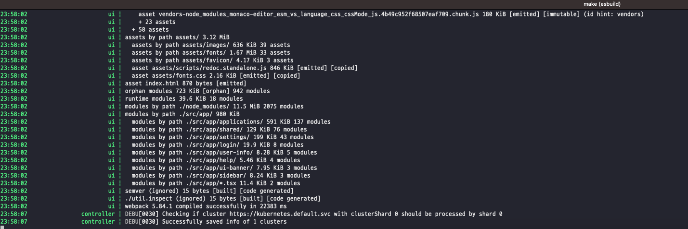

# Getting Start

## 목차
- [Getting Start](#getting-start)
  - [목차](#목차)
  - [로컬 환경 구성도](#로컬-환경-구성도)
  - [로컬 환경 설치하기](#로컬-환경-설치하기)
    - [goreman 설치](#goreman-설치)
    - [kind 설치](#kind-설치)
    - [argocd clone 받기](#argocd-clone-받기)
    - [kind argocd 클러스터 생성 및 context 설정](#kind-argocd-클러스터-생성-및-context-설정)
    - [argocd kubernetes 설정](#argocd-kubernetes-설정)
    - [로컬 서버 실행](#로컬-서버-실행)


## 로컬 환경 구성도
[ArgoCD 로컬 설치 가이드](https://argo-cd.readthedocs.io/en/stable/developer-guide/running-locally/)를 따라 kind 와 goreman 을 이용해서 로컬 환경을 구성합니다.  

먼저, 쿠버네티스 클러스터는 kind 를 사용해서 로컬 환경에 구성하도록 합니다.

다음으로, ArgoCD 의 실제 컴포넌트가 Pod 로 구성되는 것과 달리, 로컬 환경에서는 '프로세스' 로 각 컴포넌트를 구성하고 goreman 을 통해 프로세스(컴포넌트) 간 통신을 수행합니다.

이렇게 구성함으로써 컴포넌트 간 복잡한 연계를 개발에 필요한 단순한 형태로 만들 수 있습니다.

```
[로컬 머신]
  |
  |-- [Kind Kubernetes 클러스터]
  |     |
  |     |-- [Kubernetes API Server]
  |     |
  |     |-- [etcd]
  |     |
  |     |-- [ConfigMaps, Secrets 등 Kubernetes 리소스]
  |
  |-- [로컬 프로세스들 (Goreman으로 관리)]
        |
        |-- [Argo CD API Server 프로세스]
        |
        |-- [Argo CD Repo Server 프로세스]
        |
        |-- [Argo CD Application Controller 프로세스]
        |
        |-- [Argo CD Dex Server 프로세스]
        |
        |-- [Argo CD Redis 프로세스]
        |
        |-- [Argo CD UI 프로세스]
        |
        |-- [ ... ]

[개발자의 코드 에디터/IDE]
  |
  |-- [Argo CD 소스 코드]
```


## 로컬 환경 설치하기
* 공식 가이드에 있는 내용을 시행착오를 거쳐 구성한 내용이라 오류가 있을 수 있습니다 :disappointed_relieved:
* 맥북을 이용한 환경 설정을 기준으로 하였습니다. 윈도우는 Docker Desktop 및 WSL 을 이용한 환경 구성부터 필요할 것 같습니다.


### goreman 설치
프로세스 관리를 위한 goreman 을 설치합니다.  
맥북이라면 공식 가이드대로 brew 를 이용한 설치를 권장합니다.
```
brew install goreman
```

### kind 설치
로컬 쿠버네티스 환경 구성을 위한 kind 를 설치합니다.
역시 brew 를 이용한 설치를 진행합니다.
```
brew install kind
```

### argocd clone 받기
git clone 을 통해서 argocd 소스 코드를 내 로컬 머신으로 가져옵니다.
origin 및 upstream 등 코드 자체에 대한 설정은 별도 git 가이드에 따라 진행합니다.

> 이하 로컬 설치 작업은 모두 clone 받은 루트 디렉토리 위치(argo-cd) 에서 진행합니다.


### kind argocd 클러스터 생성 및 context 설정
kind 에 argocd 클러스터를 생성하고 context 설정을 추가합니다.
```
kind create cluster --name argocd --kubeconfig ~/.kube/config-kind

export KUBECONFIG=~/.kube/config-kind
kubectl config set-context --current --namespace=argocd
```

**확인**
아래 두 명령어가 오류 및 빈 값을 반환하지 않아야 합니다.
```
Kind get clusters
cat $KUBECONFIG
```

### argocd kubernetes 설정
이제 argocd 네임스페이스 생성 및 리소스 인스톨을 진행합니다. (manifest push)
```
kubectl create namespace argocd
kubectl apply -n argocd --force -f manifests/install.yaml
```

### 로컬 서버 실행
이제 로컬 argocd 서비스를 실행할 수 있습니다.
```
make start-local ARGOCD_GPG_ENABLED=false
```

아래와 같이 별다른 에러 출력(빨간색 라인)이 없다면 잘 설치된 것입니다.


대시보드로 들어가기 위해서는 localhost:4000 으로 접속합니다.


**로컬 서비스 포트 번호**
Argo CD API 서버: 8080
Argo CD UI 서버: 4000
Helm 레지스트리 서버: 5000