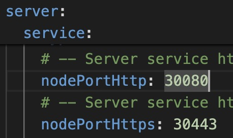
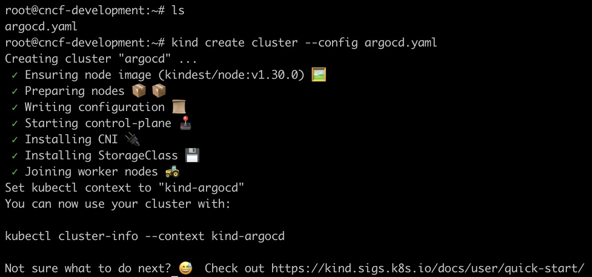

# Kubernetes Cluster

## 목차
1. [전제조건](#전제조건)
2. [클러스터 생성](#클러스터-생성)

## 전제조건
* [Docker](https://docs.docker.com/engine/install/)
* [kubectl](https://kubernetes.io/ko/docs/tasks/tools/#kubectl)
* [kind](https://kind.sigs.k8s.io/docs/user/quick-start#installation)

위 구성 요소는 쿠버네티스 클러스터를 생성을 위해 반드시 필요한 요소입니다.\
각 환경에 따라 설치를 진행합니다.

## 클러스터 생성


argocd의 helm chart로 배포하는 경우 service type을 NodePort로 지정하면 Default로 `30080`, `30443` 포트를 사용합니다.

```yaml
kind: Cluster
apiVersion: kind.x-k8s.io/v1alpha4
name: argocd
nodes:
- role: control-plane
  extraPortMappings:
  - containerPort: 30080
    hostPort: 30080
  - containerPort: 30443
    hostPort: 30443
- role: worker
```
kind config를 위와 같이 작성합니다.\
필요에 따라 사용하고 싶은 임의의 포트로 작성해도 됩니다.

```sh
kind create cluster --config <config.yaml>
```
위 명령어를 통해 클러스터를 생성합니다. 아래와 같이 진행되는지 확인합니다.



```sh
kind get clusters

kubectl get pod -A
```
위 명령어를 통해 클러스터가 정상적으로 생성됐는지 확인합니다.
아래와 같은 결과가 나오는지 확인합니다.

