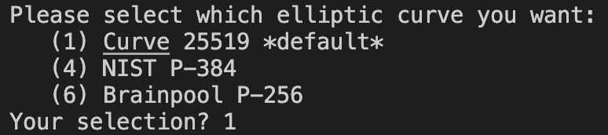
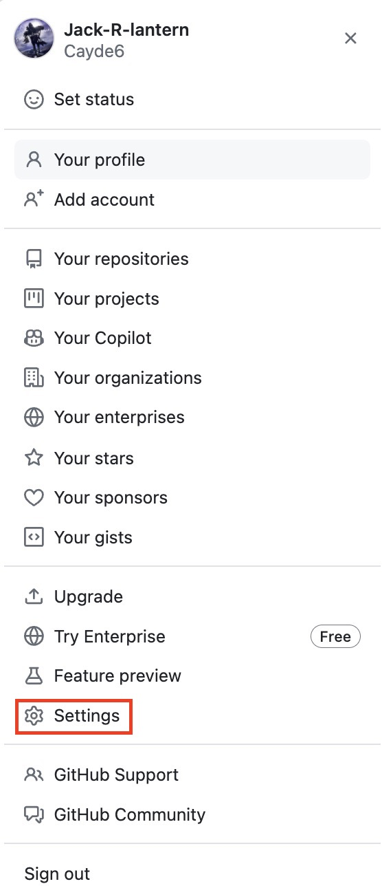

# GPG

## 목차
1. [GPG 생성하기](#gpg-생성하기)
2. [GPG 키 Github 계정에 등록하기](#gpg-키-github-계정에-등록하기)
3. [GPG 키를 이용해 커밋에 서명하기](#gpg-키를-이용해-커밋에-서명하기)

## GPG 생성하기
1. 개발환경의 운영체제에 맞는 GPG cli를 다운로드 및 설치합니다.

2. `gpg --version`을 통해 설치된 GPG cli 버전을 확인합니다.
	

3. GPG 키 쌍을 생성합니다.
	* 버전 2.1.17 이상인 경우 아래 텍스트를 이용해 GPG 키 쌍을 생성합니다.
		```shell
		gpg --full-generate-key
		```
	* 버전 2.1.16 이하인 경우 `gpg --full-generate-key` 명령이 작동하지 않습니다. 아래 텍스트를 붙여넣고 6단계로 건너뜁니다.
		```shell
		gpg --default-new-key-algo rsa4096 --gen-key
		```
4. 프롬프트에서 원하는 키 종류를 지정하거나 Enter를 눌러 기본값을 적용합니다.
	

5. 프롬프트에서 원하는 키 크기를 지정하거나 Enter를 눌러 기본값을 적용합니다.
	

6. 키가 유효해야 하는 시간을 입력합니다. Enter 키를 눌러 키가 만료되지 않음을 나타내는 기본 선택을 지정합니다. 만료 날짜가 필요하지 않은 경우 이 기본값을 적용하는 것이 좋습니다.

	

7. 사용자 ID정보를 입력합니다.
	

8. 보안 암호를 입력합니다.

9.  `gpg -k`를 이용해 정상적으로 생성됐는지 확인합니다.
	

## GPG 키 Github 계정에 업로드하기
1. `gpg --list-secret-keys --keyid-format=long` 명령을 사용하여 퍼블릭 키와 프라이빗 키가 모두 있는 긴 형식의 GPG 키를 나열합니다. 커밋 또는 태그에 서명하려면 프라이빗 키가 필요합니다.
	

2. 사용하려는 GPG 키 ID로 대체하여 아래 텍스트를 붙여넣습니다. 이 예제에서 GPG 키 ID는 BDB186BBBA0FC865 입니다.
	```
	gpg --armor --export BDB186BBBA0FC865 # ID는 개인이 만들어서 생성된 ID 사용
	```

3. `-----BEGIN PGP PUBLIC KEY BLOCK-----`로 시작하고 `-----END PGP PUBLIC KEY BLOCK-----`로 끝나는 GPG 키를 복사합니다.

4. github 페이지의 오른쪽 위 모서리에서 프로필 사진을 클릭한 다음 설정 클릭합니다.
   

5. 사이드바의 `Access` 섹션에서 `SSH and GPG Keys`를 클릭합니다.
	

6. `GPG keys` 헤더 옆에 있는 `New GPG key`를 클릭합니다.
	

7. `Title` 필드에 GPG 키의 이름을 입력합니다.

8. `Key` 필드에 GPG 키를 생성할 때 복사한 GPG 키를 붙여넣습니다.

9. GPG 키 추가를 클릭합니다.

10. 작업을 확인하려면 GitHub 계정에 인증합니다.

## GPG 키를 이용해 커밋에 서명하기
### global

```sh
git config --global user.email <your email>
git config --global user.name  <your name>
git config --global user.signingkey <your gpg keyname>
git config --global commit.gpgsign true
git config --global gpg.program gpg
```
위 명령어를 통해 git config 전역 설정

```sh
git config --global --list
```
config의 key/value 확인


### local

```sh
git config --local user.email <your email>
git config --local user.name  <your name>
git config --local user.signingkey <your gpg keyname>
git config --local commit.gpgsign true
git config --local gpg.program gpg
```
위 명령어를 통해 프로젝트 repo에 git config local 설정

```sh
git config --local --list
```
config의 key/value 확인

### 서명 확인하기
* github
	

	push한 커밋에 `verified` 확인
* local
	

	`git log --show-signature -1` 입력 사진과 유사한지 확인.

### debugging
```
gpg: signing failed: Inappropriate ioctl for device
```
위와 같은 Error 메시지가 발생한다면 `.basrc` 같은 shell 설정에 `export GPG_TTY=$(tty)` 추가.
```
gpg failed to sign the data failed to write commit object
```
위와 같은 Error 메시지가 발생하면 `ssh-add`를 실행해본다.


위에서 설명한 것과 다른 에러가  발생한다면 `GIT_TRACE=1 (git 명령어)`로 에러를 디버깅해본다.

아래 링크를 보면서 해당되는 에러를 해결해본다.

[참고](https://gist.github.com/paolocarrasco/18ca8fe6e63490ae1be23e84a7039374?permalink_comment_id=3825285)
